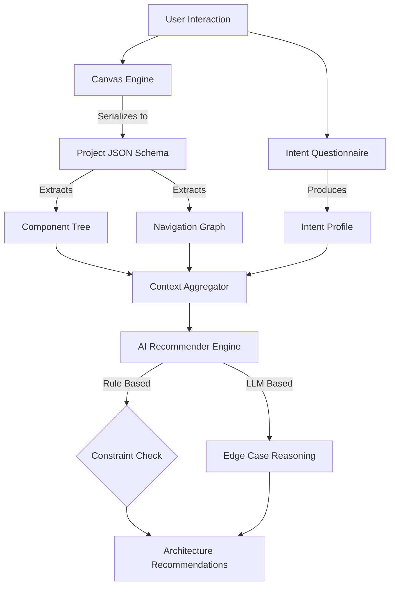

# Wireframe System Context

## 🎯 Problem Definition
**Wireframe** is an "Architectural Prototyping" tool that bridges the gap between visual design and technical implementation. Unlike standard vector design tools (Figma), it enforces technical semantics (DOM mapping, Navigation routing) during the ideation phase, allowing it to "understand" what is being built and strictly guide the backend architecture.

## 🧩 Core Components

1.  **Canvas Engine**: A visual editor for placing structural UI components (not pixels).
    *   *Input*: Drag-and-drop interactions.
    *   *State*: Screen coordinates, Component props, Device presets.
2.  **Navigation Graph**: A directed graph engine modeling user flows.
    *   *Nodes*: Screens.
    *   *Edges*: Action-based connections (Tap, Swipe, Conditional).
3.  **Intent Capture Module**: A structured questionnaire system.
    *   *Role*: Extracts high-level non-functional requirements (Scale, Compliance, Real-time needs).
4.  **Architectural Recommender**: The AI/Logic core.
    *   *Role*: Synthesizes visual structure + user intent into a concrete tech stack.

## 🔄 Data Architecture & Flow

## 🤖 AI Involvement
AI is utilized as an **Inference Engine**, not just for generation.
1.  **Implicit Detection**: Analyzes the wireframe (e.g., "User put a `CreditCardInput` + `VideoPlayer`") to infer technical needs (Payment Gateway + Streaming Server) without explicit prompting.
2.  **Conflict Resolution**: Balances conflicting requirements (e.g., "User asked for simple blog but drew a 50-screen social app") to suggest appropriate compromises.
3.  **Stack Selection**: Recommends Frontend/Backend/DB/Cloud services based on the synthesized context.

## 🛠️ Usage Context
This system allows developers to:
1.  **Draw** their idea.
2.  **Connect** the flows.
3.  **Export** a validated technical roadmap and starter codebase (future).
